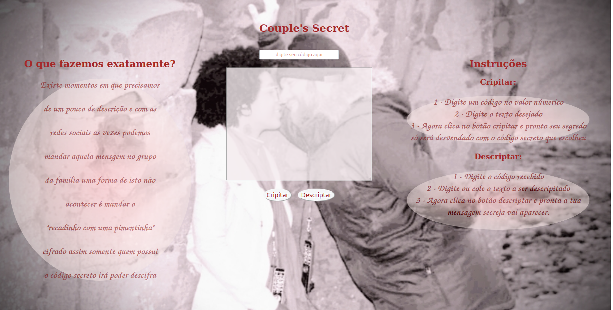

  

--- 
Você pode acessar e testar o deploy do projeto neste link https://karina1981.github.io/SAP004-cipher/

---
## Índice
- [1. Apresentação](#1-apresentacao)
- [2. Resumo do projeto "história do Usuário"](#2-resumo-do-projeto-historia-do-Usuario)
- [3. Planejamento](#3-planejamento)
- [4. Instalação](#4-instalacao)
- [5. Autoria e Considerações Finais](#5-autoria-e-consideracoes-finais)

## Apresentação

Somos um canal que se preocupa com a intregridade dos nossos clientes.

## Resumo do Projeto história do Usuário

Existe momentos em que os casais precisam de um pouco de descrição e com as redes sociais as vezes podemos mandar aquela mensgem no grupo da familia uma forma de isto não acontecer é mandar o "recadinho com uma pimentinha" cifrado assim somente quem possui o código secreto irá poder descifra 

## Planejamenteo
- A página permite escolher entre encripitar ou descripitar, um texto utilizando o algoritimo Cifra de Cesar. 

- Cripitar:
  - Digite um código de valor númerico
  - Digite o texto desejado
  - Clique no botão cripitar para que seu texto seja Codificado
  - O texto Codificado aparecerá logo abaixo do botão.

- Descriptar
  - Digite o código de valor numérico recebido
  - Digite ou cole o texto a ser descripitado
  - Clique no botão descriptar para que seu texto seja Decodificado.
  - O texto Descodificado aparecerá logo abaixo do botão.

## Instalação:

como fazer deploy, instalar e executar a aplicação 
1. Clone o projeto para seu computador utilizando o comando `git clone`.
2. Instale as dependências do projeto rodando o comando npm install. Mas antes disso tenha certeza de ter instalado o Node.js (versao 6 a 9) (que inclui o npm).
3. Se tudo foi bem, você deve conseguir executar os testes unitários com o comando npm test.
4. Para ver a interface do seu programa no navegador, use o comando npm start para iniciar o servidor web e entre na url http://localhost:5000 no seu navegador

<b>Desenvolvido por:</b>
Esse projeto foi desenvolvido individualmente por mim Karina Pereira como parte do bootcamp < Laboratoria >. desafio e prazer em criar algo do zero e sozinha claro que com ajuda e mentoria!

